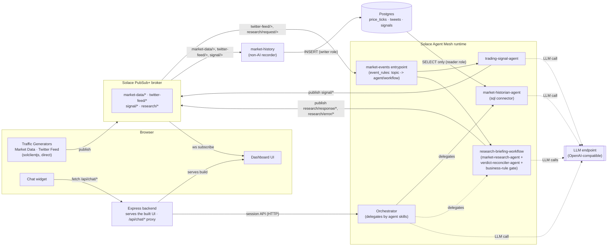
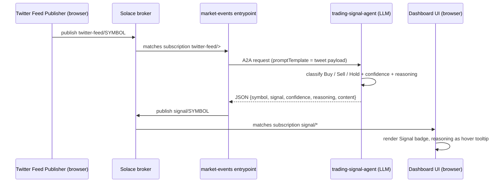
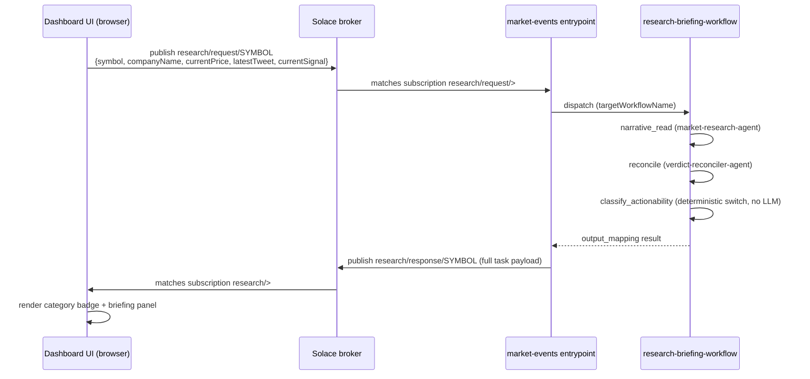
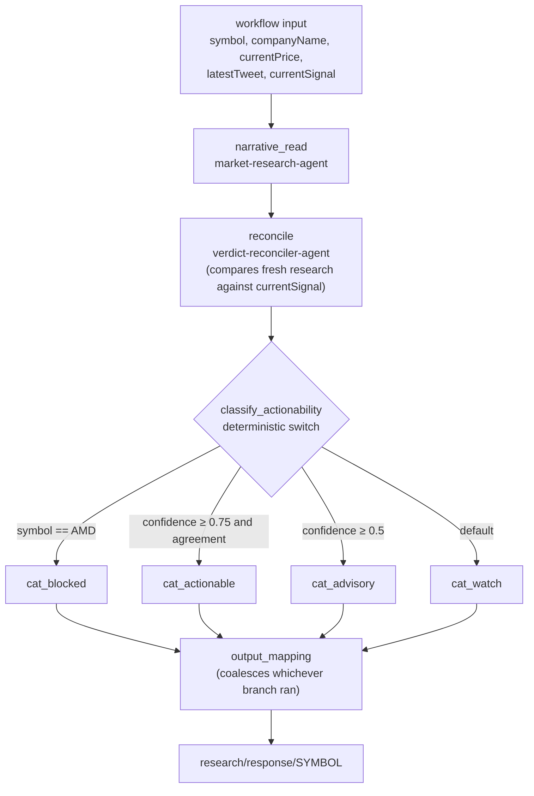
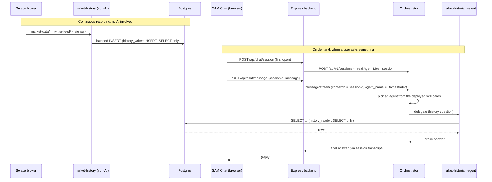

# Market Pulse Dashboard

A real-time trading dashboard that pairs **Solace PubSub+** (the broker) with **Solace Agent
Mesh** (SAM — the AI layer). Live market data streams straight into the browser over Solace
WebSockets; social-media chatter and "Research" clicks are picked up by SAM off the same broker,
reasoned about by LLM-backed agents and a workflow, and the results are published right back onto
it for the dashboard to render — the broker is the only integration point for that whole path.

That live traffic is also recorded into Postgres by a separate, non-AI service, and **SAM Chat** in
the dashboard's corner lets you ask the mesh about it in plain language — routed through Agent Mesh's
Orchestrator so one window reaches every agent, with the AI holding read-only database access
enforced by Postgres grants.

Everything runs from one `docker compose up`: broker, database, Agent Mesh, recorder, and dashboard.

This doc is written for someone opening the repo for the first time: how to run it, how to demo
it, how the pieces talk to each other, and exactly which topics carry what.

## Contents

- [What this demonstrates](#what-this-demonstrates)
- [Quick start](#quick-start)
- [Running the demo](#running-the-demo)
- [Architecture](#architecture)
- [How data flows](#how-data-flows)
- [Topic reference](#topic-reference)
- [Solace Agent Mesh components](#solace-agent-mesh-components)
- [Ports](#ports)
- [Troubleshooting](#troubleshooting)
- [Development](#development)
- [Notes on agent output](#notes-on-agent-output)

## What this demonstrates

Three things at once, deliberately:

1. **The broker.** The dashboard's Traffic Generators publish directly from the browser
   (`solclientjs`) with real QoS knobs exposed in the UI — delivery mode, message eliding, DMQ
   eligibility — and the dashboard subscribes using topic wildcards across a hierarchy
   (`market-data/EQ/{country}/{exchange}/{symbol}`). It's a live playground for PubSub+ mechanics,
   not just a data feed.
2. **Solace Agent Mesh.** The event-driven AI path never calls an LLM over HTTP: an **entrypoint**
   maps broker topics to **agents** and a **workflow**, and each result is published back onto the
   broker, so the dashboard renders it as just another subscriber. The **workflow** additionally
   chains agents together with deterministic business-rule gating in between.
3. **Conversational access to the whole mesh.** A separate, non-AI service records broker traffic
   into Postgres; an agent reads it (read-only, enforced by database grants) via SAM's SQL
   connector. **SAM Chat** in the dashboard's corner then routes questions through the
   **Orchestrator**, which delegates to whichever agent fits — history, research, or signals — over
   **real Agent Mesh sessions**, the same ones its own Web UI lists.

## Quick start

### Prerequisites

- Docker Desktop
- An LLM API key (any OpenAI-compatible endpoint, or Anthropic). **This is the only external
  credential needed.**
- The Solace Agent Mesh release archive from <https://products.solace.com/> (navigate to
  `Agent_Mesh`). Agent Mesh images are not on a public registry, so they have to be loaded once by
  hand. The broker image is pulled normally from Docker Hub.

### 1. Load the Agent Mesh image (one time)

```bash
./scripts/load-sam-images.sh /path/to/agent-mesh-artifacts
```

Defaults to `~/dev/sam_go`, or set `SAM_ARTIFACT_DIR`. The script picks the archive matching your
CPU architecture, skips work if the image is already loaded, and prints the tag it loaded.

### 2. Configure your LLM key

```bash
cp .env.sample .env
# edit .env and set LLM_SERVICE_API_KEY (plus endpoint/model if not using OpenAI)
```

### 3. Start everything

```bash
docker compose up
```

That starts eight services and needs no manual setup anywhere — no broker configuration, no
database setup, no clicking around the Agent Mesh UI:

| Service | What it is |
|---|---|
| `broker` | Solace PubSub+ Standard — the single broker every component shares |
| `postgres` | the market-history database (schema + least-privilege roles created on first start) |
| `agent-mesh` | Agent Mesh runtime (entrypoint executor, agents, workflow engine, all embedded) |
| `sam-config` | one-shot: applies `solace-agent-mesh/` to the runtime, then exits |
| `market-history` | records broker traffic into Postgres so history can be queried (non-AI) |
| `client-usernames` | one-shot: provisions `demo`/`demo` and `sun`/`sun` on the broker via SEMP |
| `queue-guardrail` | one-shot: caps a queue's backlog TTL via SEMP (see [Topic reference](#topic-reference)) |
| `dashboard` | the React + Express dashboard |

### 4. Open it

| URL | What |
|---|---|
| <http://localhost:47173> | the dashboard |
| <http://localhost:47801> | Agent Mesh UI (chat, agent list, task/workflow monitoring — **Activities** tab) |
| <http://localhost:47081> | broker admin (SEMP) — `admin` / `admin` |

## Running the demo

1. Open the dashboard and click **Connect** in the *Solace Connection* panel (defaults to
   `demo`/`demo`, already correct for the bundled broker — provisioned by the `client-usernames`
   service above; a second identity, `sun`/`sun`, is also provisioned for external tools like the
   Sunburst Topic Explorer behind the Topic Explorer button, which needs its own connection typed
   in separately since it's a third-party page in an iframe).
2. Search for a stock (e.g. `NVDA`) in *Stock Selection* and add it.
3. Under *Traffic Generators*, **Start** both the Market Data Publisher and the Twitter Feed
   Publisher. Prices start moving immediately.
4. Within ~30s a tweet is published, the trading-signal agent reasons about it, and the **Signal**
   column fills in with Buy/Sell/Hold. Hover the signal to see the agent's one-line rationale.
5. Click **Research** on the row. A panel slides in from the right and — a few seconds later —
   shows a category badge (Actionable / Advisory / Watch Only / Blocked) plus a full briefing,
   grounded in that stock's live price, latest post, and current signal.
6. Add `AMD` and click **Research** on it too. It comes back **Blocked** regardless of what the
   signal or the research narrative says — a deterministic compliance rule in the workflow
   overrides the AI's read entirely. Good moment to make the point that AI output is *gated* by
   ordinary business logic, not the last word.
7. Click the **Activity** icon in the header to deep-link into the Agent Mesh UI's Activities tab
   and show the actual agent/workflow tasks that just ran — proof this isn't a canned response.
8. Click the **chat bubble** in the bottom-right corner to open **SAM Chat**. It talks to the
   Orchestrator, which picks the right agent for each question, so one window covers several:
   - *"What symbols do you have recorded data for?"* / *"What was NVDA's price range in the last 10
     minutes?"* → routed to the historian, which queries the recorded history
   - *"Give me a research briefing on NVDA"* → routed to the research agent
   - *"How many Buy signals were there today, and did they agree with the tweets?"* → history again,
     joining signals against posts

   Let the generators run a few minutes first so there's something to talk about. The routing itself
   is the point worth narrating: the dashboard doesn't know which agent answers.
9. Optionally open <http://localhost:47801> — the conversations from step 8 are in its session list,
   because they're the same Agent Mesh sessions. Continue one there to show the chat isn't a
   dashboard-local gimmick, and check the **Activities** tab to see the Orchestrator's delegation to
   another agent as separate tasks.

> **Demo tip:** leave the Twitter Feed Publisher near its default 2 tweets/min. The slider goes much
> higher, and while no messages are lost, each tweet costs one LLM call — crank it up and the
> signals visibly lag behind the ticker.

## Architecture



Note the two distinct AI paths: signals and research travel **over the broker** (event-driven,
fire-and-forget), while chat goes **over HTTP** through the backend — because it needs Agent Mesh's
own session concept for multi-turn memory, which the event-mesh entrypoint has no equivalent of.
Chat enters at the **Orchestrator**, which reads the deployed agents' skill cards and delegates, so
one window covers history, research, and signals rather than a single topic.
Recording is one-directional: `market-history` writes, the agent only reads.

- **Frontend**: React + TypeScript + Vite + shadcn/ui, TradingView lightweight-charts. Connects to
  the broker directly over WebSockets using `solclientjs` — this is the entire real-time path.
- **Backend**: Express. Serves the built frontend and a few REST endpoints (stock list, saved
  config); it does not sit between the browser and the broker for live data.
- **AI**: Solace Agent Mesh (Go), configured declaratively under `solace-agent-mesh/` and applied
  by the `sam-config` service on every `docker compose up`.
- **Messaging**: one Solace PubSub+ Standard broker, shared by literally everything — the browser,
  the dashboard backend, and every Agent Mesh component.

## How data flows

Four distinct flows. The first three run through the broker (only flows 2 and 3 touch an LLM); the
fourth is the chat path, which deliberately does not.

### 1. Market data — browser to browser

The Market Data Publisher (running in the browser) publishes synthetic price ticks directly onto
`market-data/EQ/{country}/{exchange}/{symbol}`. The dashboard's own subscription — often a wildcard
like `market-data/EQ/US/>` — picks them straight back up. Nothing else is involved; this flow
exists purely to exercise the broker (rate, QoS, topic wildcards), not to demonstrate AI.

### 2. Tweet → trading signal (one agent)



The entrypoint acks `on_receive` (a dropped tweet isn't worth redelivering) and the response topic
is dynamic — `signal/{symbol}` — built from the tweet's own payload via `forwardContext`.

### 3. Research click → workflow (three agents + a compliance gate)



Unlike the signal flow, this one acks `on_completion` with a 180s timeout — a user is watching a
spinner, so the request can't be dropped, but it also needs to survive a slow LLM round trip.

Inside the workflow itself:



`narrative_read` and `reconcile` are real LLM calls (on the `cheap` model). `classify_actionability`
is a plain `switch` node — no model involved — and its four terminal branches are tiny agent nodes
that just echo a fixed JSON literal, purely because this workflow DSL has no constant/literal node
type. Only one branch ever fires per run, so the cost is negligible. AMD is a hardcoded
"restricted list" example; the point is that a symbol on it is always Blocked no matter how
confident or bullish the AI read is.

### 4. Recording history, and asking about it

Everything above is *live* — it exists only as it flies past. This flow makes it queryable, and is
the one place AI reads a database instead of a message.



A research or signal question takes the same path with the Orchestrator delegating elsewhere — the
browser, the proxy, and the session are identical either way.

Three things about this are deliberate:

- **SAM never writes.** The historian authenticates as `history_reader`, which Postgres grants
  `SELECT` and nothing else. This matters because SAM's SQL connector hands the agent a
  general-purpose SQL tool and its own docs are explicit that *"Agent Mesh cannot restrict what
  queries agents execute — access control must be configured at the database level."* So the
  guarantee lives in `db/init/002-roles.sh`, not in prompt wording. Even the writer role has no
  `UPDATE`/`DELETE`, making the tables an append-only log.
- **Chat uses real Agent Mesh sessions, not a homegrown chat channel.** The widget's conversations
  appear in the Agent Mesh Web UI's own session list, and multi-turn memory is the platform's —
  nothing is re-sent from the browser each turn. The backend proxies because that API returns no
  CORS headers for the dashboard's origin (verified), and because it's explicitly labelled an
  unstable Early Access surface — keeping it in one module (`dashboard/server/services/samChatService.ts`)
  contains the blast radius of a breaking change.
- **Chat goes to the Orchestrator, not a fixed agent.** It reads every deployed agent's `skills`
  block and delegates, so the same window answers "what was NVDA's range?" (historian), "brief me
  on TSLA" (research), and signal questions — without the dashboard needing to know which agent
  owns what. Because `agent_name` is a per-request parameter rather than config, pointing chat at a
  single agent instead is just `SAM_CHAT_AGENT=market-historian-agent` — no `sam config apply`.
- **History can have gaps, by design.** `market-history` uses plain topic subscriptions with
  `DIRECT` delivery, not a durable queue, and the dashboard's own eliding toggle can drop ticks
  under load. So a restart leaves a hole. The agent's prompt therefore tells it to say plainly when
  data doesn't cover a question rather than filling the gap with invention.

## Topic reference

Every topic below flows through the one shared broker. "Publisher"/"Subscriber" describe the
*current* live flow, not every client that could technically match the wildcard.

| Topic | Publisher | Subscriber | Purpose |
|---|---|---|---|
| `market-data/EQ/{country}/{exchange}/{symbol}` | Browser (Market Data Publisher) | Browser (dashboard's own wildcard subscription) **+ `market-history`** | Live price ticks. Demonstrates broker topic hierarchy; also recorded to Postgres. |
| `twitter-feed/{symbol}` | Browser (Twitter Feed Publisher) | `market-events` entrypoint (`twitter-feed/>`) **+ `market-history`** | Simulated social-media posts — the trigger for trading-signal-agent. |
| `signal/{symbol}` | `market-events` entrypoint, on behalf of `trading-signal-agent` | Browser (dashboard `signal/*`) **+ `market-history`** | Buy/Sell/Hold + confidence + reasoning, rendered as the **Signal** column. |
| `signal/errors` | `market-events` entrypoint | `market-history` (logs it, deliberately does **not** record it as a signal) | Static fallback topic if `trading-signal-agent` errors. Note `signal/>` matches this, so any subscriber must branch on topic before parsing. |
| `research/request/{symbol}` | Browser (Research button click) | `market-events` entrypoint (`research/request/>`) | Snapshot of what the dashboard already knows: price, latest tweet, current signal. |
| `research/response/{symbol}` | `market-events` entrypoint, on behalf of `research-briefing-workflow` | Browser (dashboard `research/>`) | Full briefing + category + reasoning, rendered in the slide-out panel. |
| `research/error/{symbol}` | `market-events` entrypoint | Browser (dashboard `research/>`) | Workflow failure (e.g. timeout) — the panel shows a retry button instead of a spinner. |

Two implementation details worth knowing if you're tracing a message on the broker admin UI:

- The **expression syntax differs by context**. `promptTemplate` (agent-target input) uses single
  braces — `{payload}`, `{payload.symbol}`. `forwardContext` and dynamic topics use double braces
  with a **colon**, not a dot, for sub-paths — `{{ user_data.forward_context:symbol }}`. Mixing
  these up is the single most common way to get a topic like the literal string
  `signal/{payload.symbol}` instead of `signal/NVDA`.
- `research_request`'s `successOutput.responseType` is `full`, not `text` or `structured`. Only
  `full` actually carries the workflow's result data (nested at
  `status.message.parts[0].data`) — the other two were tried and don't. See
  `dashboard/client/src/lib/agentPayload.ts` for the unwrap logic, and the long comment in
  `solace-agent-mesh/entrypoints/market-events.yaml` for the full story.

### Backlog guardrail

`market-events` auto-provisions a `tweet_to_signal` queue in front of `trading-signal-agent` with no
TTL. The `queue-guardrail` one-shot service patches that queue via SEMP on every `docker compose up`
(`scripts/set-tweet-queue-ttl.sh`) so a long-running demo can't quietly build an unbounded backlog
if the agent ever falls behind — a stale tweet is dropped instead of piling up and later firing a
burst of LLM calls. Configurable via `TWEET_QUEUE_TTL_SECONDS` in `.env` (default 300s).

## Solace Agent Mesh components

Agents, the workflow, and the entrypoint are all version-controlled YAML under
`solace-agent-mesh/`, applied declaratively by the `sam-config` service:

```
solace-agent-mesh/
├── manifest.yaml                          which resources to apply, and where
├── models/
│   ├── general.yaml                       chat-tier LLM alias (Orchestrator, Builder, historian)
│   └── cheap.yaml                         high-frequency-tier alias (the pipeline agents)
├── connectors/
│   └── market-history-connector.yaml      read-only SQL access to the history database
├── agents/
│   ├── trading-signal-agent.yaml          tweet -> Buy/Sell/Hold
│   ├── market-research-agent.yaml         fresh narrative research on a symbol
│   ├── verdict-reconciler-agent.yaml      compares research against the existing signal
│   └── market-historian-agent.yaml        queries recorded history (SAM Chat, via Orchestrator)
├── workflows/
│   └── research-briefing-workflow.yaml    reconcile + deterministic compliance/actionability gate
└── entrypoints/
    └── market-events.yaml                 broker topics -> agent/workflow targets
```

### Entrypoint (`market-events.yaml`)

An `event_mesh` entrypoint is the bridge between plain broker topics and Agent Mesh. It holds a
list of `event_rules`, each one binding a topic subscription to either `targetAgent` (a single
agent) or `targetWorkflowName` (a multi-step workflow), plus where to publish the result. This demo
declares two rules — `tweet_to_signal` (→ `trading-signal-agent`) and `research_request` (→
`research-briefing-workflow`) — described in [How data flows](#how-data-flows) above.

One thing worth calling out explicitly since it's easy to get wrong and fails *silently*:
`targetWorkflowName` gets no name→ID resolution at deploy time the way `targetAgent` does — it must
exactly match the workflow's own `display_name`, or the dispatch quietly goes nowhere. Both YAML
files carry a detailed comment on this; it's not something you'd otherwise discover from an error
message.

### Agents

| Agent | Model | Role |
|---|---|---|
| `trading-signal-agent` | `cheap` | Reads one social-media post, returns Buy/Sell/Hold + confidence + a one-line rationale. No toolsets — pure reasoning over the payload it's given. |
| `market-research-agent` | `cheap` | Produces a short analyst-style briefing for a symbol from the live context the dashboard sends (price, latest post, current signal). Ships with **no toolsets** on purpose — real web search needs Google CSE credentials this demo doesn't require; see the comment in the agent's YAML to enable it. |
| `verdict-reconciler-agent` | `cheap` | Used only inside the workflow (never triggered by an entrypoint rule). Compares the fresh research against the signal already on the mesh and scores agreement/confidence; its instruction is overridden per-node to also serve as the workflow's fixed-JSON terminal branches. |
| `market-historian-agent` | `general` | Queries the recorded history in Postgres through `market-history-connector` and answers in prose. Not part of any event pipeline and not triggered by the broker — reached when the Orchestrator delegates a history question from SAM Chat. |
| `Orchestrator` (built-in) | `general` | Platform-seeded, not declared in this repo. What SAM Chat actually talks to: it reads the deployed agents' skill cards and delegates each question to whichever fits. |

The first three run on `cheap`; the historian runs on `general` — see [Models](#models) below.

### Connector (`market-history-connector.yaml`)

A `connector` resource (this repo's only one) gives an agent access to something outside the mesh.
`type: sql`, `subtype: postgres`, pointed at the `postgres` service. SAM has **no SQLite subtype** —
`sam config schema show connector --type sql` offers only postgres/mysql/mariadb/mssql/oracle —
which is why the history database is Postgres.

Its `username` is the security boundary: `history_reader` holds `SELECT` and nothing else, because
the connector gives the agent a general SQL tool that SAM itself cannot police. See
[How data flows](#4-recording-history-and-asking-about-it).

### Workflow (`research-briefing-workflow.yaml`)

A `workflow` resource chains nodes (`agent`, `switch`, `tool`, `loop`, ...) with explicit
`depends_on` edges and a final `output_mapping`. This demo's workflow has five node "layers":
`narrative_read` → `reconcile` → `classify_actionability` (a `switch`, no LLM) → one of four
terminal category nodes → `output_mapping`. Full breakdown and diagram in
[How data flows](#how-data-flows).

### Models

`general.yaml` and `cheap.yaml` both wrap the *same* underlying LLM endpoint
(`LLM_SERVICE_ENDPOINT` / `LLM_SERVICE_API_KEY` in `.env`) but under two aliases with independently
overridable model names — `LLM_SERVICE_GENERAL_MODEL_NAME` and `LLM_SERVICE_CHEAP_MODEL_NAME`. The
three pipeline agents are pinned to `cheap` because they run on every tweet and every Research click;
Agent Mesh's built-in Orchestrator/Builder chat agents stay on `general`, and so does
`market-historian-agent` — it fires at human typing cadence and has to write correct SQL and then
narrate the results, which is the worst place to economize. Point `cheap` at your provider's
fastest/cheapest capable tier (`gpt-4o-mini`, Claude Haiku, Gemini Flash, ...) to keep a long demo
session inexpensive.

### Changing an agent or the workflow

Edit the YAML, then re-run:

```bash
docker compose run --rm sam-config
```

Applies are additive: deletes are skipped unless you pass `--prune`, so the built-in Orchestrator
and Builder agents are never removed. To preview changes first:

```bash
docker compose run --rm sam-config config plan -m /config/manifest.yaml --no-dotenv
```

## Ports

Host ports all live in the uncommon **47xxx** range on purpose, so they don't collide with other
projects' dev servers or containers on the same machine (5173 is Vite's own default, 8080/8081 are
generic dev-http defaults, 8800/8801 collide with the Agent Mesh desktop app, 8008 is Solace's own
websocket convention — all frequently already in use). They're also all below 49152: macOS reserves
49152–65535 as its ephemeral range, so Solace's conventional **55555 cannot be published reliably on
a Mac** — a transient outbound connection grabs it and the container fails to bind.

| Service | Host | Container | Notes |
|---|---|---|---|
| Broker WebSocket | **47008** | 8008 | what the browser uses |
| Broker SMF | **47555** | 55555 | only for host-run tools; containers use `broker:55555` internally |
| Broker SEMP admin | **47081** | 8080 | |
| Agent Mesh UI | **47801** | 8800 | |
| Dashboard | **47173** | 5000 | host 5000 is taken by macOS AirPlay |
| Postgres (history) | **47432** | 5432 | only for `psql` from the host; in-stack consumers use `postgres:5432` |

## Troubleshooting

**Agent Mesh exits with `connect external broker: ... Service Unavailable`**
It started before the broker was accepting client logins. Compose gates on the broker's
`guaranteed-active` health probe and restarts `agent-mesh` automatically, so this self-heals.
Note the runtime needs `tcp://broker:55555`; the `ws://` port 47008 is browser-only and returns
exactly this error.

**Signals never appear**
Check `docker compose logs agent-mesh` for LLM errors — an invalid key or a model your key cannot
access surfaces there and is also published to `signal/errors`. Verify your model with:

```bash
curl -H "Authorization: Bearer $LLM_SERVICE_API_KEY" $LLM_SERVICE_ENDPOINT/models
```

**Changed the LLM key in `.env` but Agent Mesh still uses the old one**
Model aliases are seeded from the environment only on a first run against an empty database, then
persisted. Re-apply the declarative config to push the new value:

```bash
docker compose run --rm sam-config
```

**Research panel spins then times out**
The request reached the broker but no reply came back. Check `docker compose logs agent-mesh`, and
confirm the entrypoint deployed: `curl -s http://localhost:47801/api/v1/platform/agents`. Also
check the Activities tab (<http://localhost:47801/#/activities>) for a task stuck as "unknown" —
that specific shape means the event dispatched but couldn't resolve its target (see the
`targetWorkflowName` caveat under [Solace Agent Mesh components](#solace-agent-mesh-components)).

**Nothing shows up in the Agent Mesh Activities tab even though signals/research are working**
Activities is scoped per-user. Both `event_rules` set `defaultUserIdentity: sam_dev_user` — the
WebUI's own dev user — deliberately, because a synthetic identity produces real, completed tasks
that simply never render in that view.

**The chat window says it can't reach Agent Mesh, or returns a 502**
The backend proxies to `agent-mesh` over the compose network. Check `docker compose ps agent-mesh`
is healthy, and that the dashboard has `SAM_PLATFORM_URL` set. Errors from the platform (an LLM
budget cap, a missing model, a bad connector password) are surfaced verbatim in the chat panel
rather than hidden — read the message before digging further.

**The chat says it has no data / history is empty**
Nothing has been recorded yet. Check the recorder is running and inserting:

```bash
docker compose logs market-history | grep inserted
docker compose exec postgres psql -U postgres -d market_history -c \
  "select 'ticks', count(*) from price_ticks union all select 'tweets', count(*) from tweets union all select 'signals', count(*) from signals;"
```

Start the Traffic Generators and give them a minute. `signals` stays at 0 until the
trading-signal agent actually produces signals (check `docker compose logs agent-mesh` for LLM
errors if tweets are flowing but signals aren't).

**I changed `db/init/*` but nothing happened**
Those scripts run only against a **fresh** data directory, so an existing volume ignores them. To
re-run from scratch (destroys recorded history):

```bash
docker compose down
docker volume rm trading-dashboard-solace_market-history-db
docker compose up
```

**Using your own broker instead of the bundled one**
A fresh PubSub+ Standard broker needs no setup: the `default` VPN accepts any credentials, SMF and
web transport are enabled, and the default client-profile already permits guaranteed messaging and
temporary-queue creation (Agent Mesh provisions its own queues). On a locked-down broker, ensure
the client profile allows guaranteed messaging **and** endpoint creation, or the event-mesh
entrypoint cannot bind its queues.

## Development

```bash
cd dashboard
npm install
npm run dev
```

This starts the Express backend and the Vite dev server together on `http://localhost:5000`. Point
the backend at the bundled broker's host-published SMF port (`tcp://localhost:47555`) rather than
`broker:55555`, which only resolves inside the compose network.

Rebuild the dashboard image (needed after any change under `dashboard/`, since it's a static build
baked into the image, not a mounted volume):

```bash
docker compose up --build dashboard
```

Repo layout, for reference:

```
dashboard/
├── client/src/
│   ├── components/       Dashboard.tsx, ResearchPanel.tsx, ChatWidget.tsx, TrafficGeneratorPanel.tsx, ...
│   ├── contexts/         TrafficGeneratorContext.tsx (browser-native publisher state)
│   ├── hooks/            useSolaceConnection.ts (the direct broker connection)
│   └── lib/              agentPayload.ts (unwraps agent/workflow replies), topicSubscriptionManager.ts
├── server/
│   ├── routes.ts          REST endpoints, incl. the /api/chat/* proxy
│   └── services/          solaceService.ts, samChatService.ts (Agent Mesh chat API client), ...
└── shared/schema.ts       types shared by client and server (ResearchBriefing, ChatTurn, topics)

market-history/            the non-AI recorder: broker -> Postgres
├── src/index.ts           Solace subscriber + topic routing
├── src/parse.ts           payload -> row, defensively (LLM output can be malformed)
└── src/db.ts              batched, append-only INSERTs

db/init/                   runs on first Postgres start only
├── 001-schema.sql         tables + indexes
└── 002-roles.sh           history_writer / history_reader roles - the read-only enforcement
```

The `market-history` service is a separate container with its own build, so changes there need:

```bash
docker compose up -d --build market-history
```

## Notes on agent output

Agent replies are LLM output, so the dashboard treats them defensively:

- Replies routinely arrive wrapped in a ```` ```json ```` fence, which makes the broker payload a
  JSON *string* rather than an object. `dashboard/client/src/lib/agentPayload.ts` unwraps this, and
  also digs the workflow's result out of the `research_request` rule's `full`-response envelope.
- The symbol a briefing belongs to is taken from the **topic**, not the payload — the topic is
  built by the entrypoint from the original request and cannot drift.
- `outputSchema` on an agent is best-effort, not a hard contract: a reply that omitted a required
  field was still published rather than rejected. The system prompts therefore name the expected
  JSON keys explicitly.
- The workflow's `category`/`categoryReason` come from a plain deterministic `switch`, not an LLM
  judgment call — that's the whole point of the compliance-gate design. Everything else in a
  briefing (`sentiment`, `keyPoints`, `risks`, `outlook`, ...) is genuine LLM output and should be
  read with the same skepticism as any other model output.
