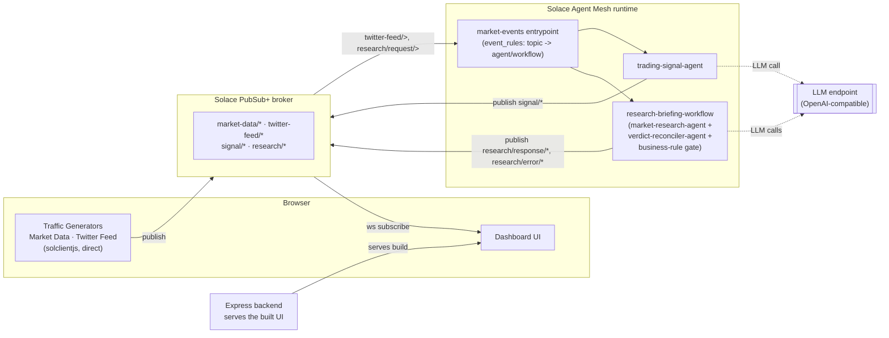
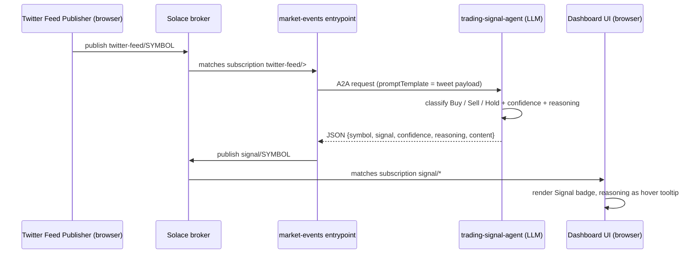
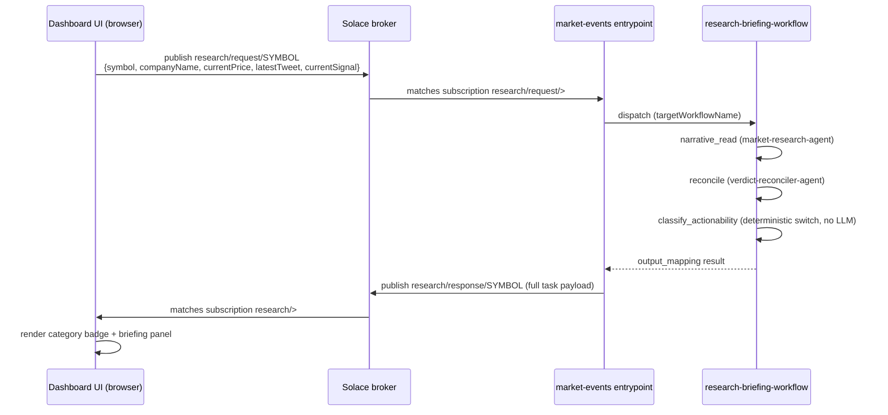
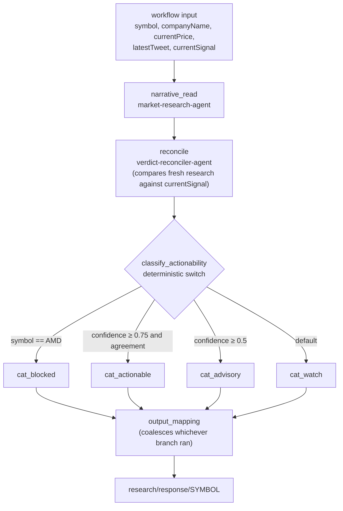

# Market Pulse Dashboard

A real-time trading dashboard that pairs **Solace PubSub+** (the broker) with **Solace Agent
Mesh** (SAM — the AI layer). Live market data streams straight into the browser over Solace
WebSockets; social-media chatter and "Research" clicks are picked up by SAM off the same broker,
reasoned about by LLM-backed agents and a workflow, and the results are published right back onto
it for the dashboard to render — the broker is the only integration point for that whole path.

Everything runs from one `docker compose up`: broker, Agent Mesh, and dashboard.

This doc is written for someone opening the repo for the first time: how to run it, how to demo
it, how the pieces talk to each other, and exactly which topics carry what.

## Contents

- [What this demonstrates](#what-this-demonstrates)
- [Quick start](#quick-start)
- [Running the demo](#running-the-demo)
- [Architecture](#architecture)
- [How data flows](#how-data-flows)
- [Topic reference](#topic-reference)
- [Solace Agent Mesh components](#solace-agent-mesh-components)
- [Ports](#ports)
- [Troubleshooting](#troubleshooting)
- [Development](#development)
- [Notes on agent output](#notes-on-agent-output)

## What this demonstrates

Two things at once, deliberately:

1. **The broker.** The dashboard's Traffic Generators publish directly from the browser
   (`solclientjs`) with real QoS knobs exposed in the UI — delivery mode, message eliding, DMQ
   eligibility — and the dashboard subscribes using topic wildcards across a hierarchy
   (`market-data/EQ/{country}/{exchange}/{symbol}`). It's a live playground for PubSub+ mechanics,
   not just a data feed.
2. **Solace Agent Mesh.** The event-driven AI path never calls an LLM over HTTP: an **entrypoint**
   maps broker topics to **agents** and a **workflow**, and each result is published back onto the
   broker, so the dashboard renders it as just another subscriber. The **workflow** additionally
   chains agents together with deterministic business-rule gating in between.

## Quick start

### Prerequisites

- Docker Desktop
- An LLM API key (any OpenAI-compatible endpoint, or Anthropic). **This is the only external
  credential needed.**
- The Solace Agent Mesh release archive from <https://products.solace.com/> (navigate to
  `Agent_Mesh`). Agent Mesh images are not on a public registry, so they have to be loaded once by
  hand. The broker image is pulled normally from Docker Hub.

### 1. Load the Agent Mesh image (one time)

```bash
./scripts/load-sam-images.sh /path/to/agent-mesh-artifacts
```

Defaults to `~/dev/sam_go`, or set `SAM_ARTIFACT_DIR`. The script picks the archive matching your
CPU architecture, skips work if the image is already loaded, and prints the tag it loaded.

### 2. Configure your LLM key

```bash
cp .env.sample .env
# edit .env and set LLM_SERVICE_API_KEY (plus endpoint/model if not using OpenAI)
```

### 3. Start everything

```bash
docker compose up
```

That starts six services and needs no manual setup anywhere — no broker configuration, no
clicking around the Agent Mesh UI:

| Service | What it is |
|---|---|
| `broker` | Solace PubSub+ Standard — the single broker every component shares |
| `agent-mesh` | Agent Mesh runtime (entrypoint executor, agents, workflow engine, all embedded) |
| `sam-config` | one-shot: applies `solace-agent-mesh/` to the runtime, then exits |
| `client-usernames` | one-shot: provisions `demo`/`demo` on the broker via SEMP |
| `queue-guardrail` | one-shot: caps a queue's backlog TTL via SEMP (see [Topic reference](#topic-reference)) |
| `dashboard` | the React + Express dashboard |

### 4. Open it

| URL | What |
|---|---|
| <http://localhost:47174> | the dashboard |
| <http://localhost:47802> | Agent Mesh UI (chat, agent list, task/workflow monitoring — **Activities** tab) |
| <http://localhost:47081> | broker admin (SEMP) — `admin` / `admin` |

## Running the demo

1. Open the dashboard and click **Connect** in the *Solace Connection* panel (defaults to
   `demo`/`demo`, already correct for the bundled broker — provisioned by the `client-usernames`
   service above). The same connection also powers the native **Topic Explorer** behind the header
   button — no separate login needed, since it opens as a resizable panel inside the dashboard
   itself (a D3 sunburst/icicle view of live topic traffic) rather than a third-party iframe.
2. Search for a stock (e.g. `NVDA`) in *Stock Selection* and add it.
3. Under *Traffic Generators*, **Start** both the Market Data Publisher and the Twitter Feed
   Publisher. Prices start moving immediately.
4. Within ~30s a tweet is published, the trading-signal agent reasons about it, and the **Signal**
   column fills in with Buy/Sell/Hold. Hover the signal to see the agent's one-line rationale.
5. Click **Research** on the row. A panel slides in from the right and — a few seconds later —
   shows a category badge (Actionable / Advisory / Watch Only / Blocked) plus a full briefing,
   grounded in that stock's live price, latest post, and current signal.
6. Add `AMD` and click **Research** on it too. It comes back **Blocked** regardless of what the
   signal or the research narrative says — a deterministic compliance rule in the workflow
   overrides the AI's read entirely. Good moment to make the point that AI output is *gated* by
   ordinary business logic, not the last word.
7. Click the **Activity** icon in the header to deep-link into the Agent Mesh UI's Activities tab
   and show the actual agent/workflow tasks that just ran — proof this isn't a canned response.

> **Demo tip:** leave the Twitter Feed Publisher near its default 2 tweets/min. The slider goes much
> higher, and while no messages are lost, each tweet costs one LLM call — crank it up and the
> signals visibly lag behind the ticker.

## Architecture



Both AI paths travel the same way — **over the broker**, event-driven, fire-and-forget — with each
result published back for the dashboard to pick up as just another subscriber. Neither the browser
nor the backend ever calls an LLM directly; the entrypoint is the only bridge between plain broker
topics and Agent Mesh.

- **Frontend**: React + TypeScript + Vite + shadcn/ui, TradingView lightweight-charts. Connects to
  the broker directly over WebSockets using `solclientjs` — this is the entire real-time path.
- **Backend**: Express. Serves the built frontend and a few REST endpoints (stock list, saved
  config); it does not sit between the browser and the broker for live data.
- **AI**: Solace Agent Mesh (Go), configured declaratively under `solace-agent-mesh/` and applied
  by the `sam-config` service on every `docker compose up`.
- **Messaging**: one Solace PubSub+ Standard broker, shared by literally everything — the browser,
  the dashboard backend, and every Agent Mesh component.

## How data flows

Three distinct flows, all of which run through the broker (only flows 2 and 3 touch an LLM).

### 1. Market data — browser to browser

The Market Data Publisher (running in the browser) publishes synthetic price ticks directly onto
`market-data/EQ/{country}/{exchange}/{symbol}`. The dashboard's own subscription — often a wildcard
like `market-data/EQ/US/>` — picks them straight back up. Nothing else is involved; this flow
exists purely to exercise the broker (rate, QoS, topic wildcards), not to demonstrate AI.

### 2. Tweet → trading signal (one agent)



The entrypoint acks `on_receive` (a dropped tweet isn't worth redelivering) and the response topic
is dynamic — `signal/{symbol}` — built from the tweet's own payload via `forwardContext`.

### 3. Research click → workflow (three agents + a compliance gate)



Unlike the signal flow, this one acks `on_completion` with a 180s timeout — a user is watching a
spinner, so the request can't be dropped, but it also needs to survive a slow LLM round trip.

Inside the workflow itself:



| Node | Type | Depends on | What it does |
|---|---|---|---|
| `narrative_read` | `agent` → `market-research-agent` (`cheap`) | workflow input | Writes the fresh briefing from `workflow.input` (symbol, companyName, currentPrice, latestTweet, currentSignal). Retries up to 2× on error. |
| `reconcile` | `agent` → `verdict-reconciler-agent` (`cheap`) | `narrative_read` | Compares the fresh research against `workflow.input.currentSignal`; outputs `agreement`, `confidence`, `verdict`, `notes`. Retries up to 2× on error. |
| `classify_actionability` | `switch` — **no LLM** | `reconcile` only | Deterministic routing: symbol `AMD` → `cat_blocked`; else confidence ≥ 0.75 *and* agreement → `cat_actionable`; else confidence ≥ 0.5 → `cat_advisory`; else (`default_case`) → `cat_watch`. |
| `cat_blocked` / `cat_actionable` / `cat_advisory` / `cat_watch` | `agent` → `verdict-reconciler-agent` reused, instruction overridden | `classify_actionability` | Each just echoes a fixed one-line JSON literal (`{"category": ..., "categoryReason": ...}`) — a workaround for this DSL having no pure-literal node type. Only the one branch the switch picked actually fires. |
| `output_mapping` *(workflow-level field, not a node)* | — | reads from all of the above | Copies `symbol`/`headline`/`summary`/`sentiment`/`keyPoints`/`risks`/`outlook`/`timestamp` from `narrative_read.output`, `agreement`/`confidence` from `reconcile.output`, and `category`/`categoryReason` via `coalesce` across all four terminal nodes (only the one that ran has a value). |

Three non-obvious things worth knowing before editing this workflow:

- **`classify_actionability` depends on `[reconcile]` only, deliberately.** An earlier design added a
  confidence-gated deliberation loop and made the switch depend on `[route, refine]`; since `refine`
  only ran on the low-confidence branch, high-confidence runs never satisfied that dependency and the
  switch was silently skipped, leaving `category` null (verified from the workflow's own output
  artifacts). The loop was cut; the single dependency is what keeps `category` reliably populated on
  every run.
- **Every terminal category node needs its own `output_schema_override`.** `verdict-reconciler-agent`'s
  real `outputSchema` is `{agreement, confidence, verdict, notes}` — that governs what the workflow
  engine extracts from a node's reply regardless of what the node's `instruction` asks for. Without the
  override, `output_mapping` fails with `field 'category' not found in node output` (confirmed via
  `sam task send` against the workflow directly).
- **`workflow.input.*` resolves empty inside `switch` conditions and `output_mapping`.** Only node
  outputs resolve reliably in that expression context, which is why the switch checks
  `narrative_read.output.symbol` rather than `workflow.input.symbol`, and why `output_mapping` reads
  `symbol`/`companyName` back off `narrative_read.output` instead of the original workflow input. This
  is different from a node's own `instruction` field, which sees `workflow.input.*` fine — that's how
  `narrative_read` and `reconcile` above get their input in the first place.

AMD is a hardcoded "restricted list" example in the first `classify_actionability` condition; the
point is that a symbol on it is always Blocked no matter how confident or bullish the AI read is.

## Topic reference

Every topic below flows through the one shared broker. "Publisher"/"Subscriber" describe the
*current* live flow, not every client that could technically match the wildcard.

| Topic | Publisher | Subscriber | Purpose |
|---|---|---|---|
| `market-data/EQ/{country}/{exchange}/{symbol}` | Browser (Market Data Publisher) | Browser (dashboard's own wildcard subscription) | Live price ticks. Demonstrates broker topic hierarchy. |
| `twitter-feed/{symbol}` | Browser (Twitter Feed Publisher) | `market-events` entrypoint (`twitter-feed/>`) | Simulated social-media posts — the trigger for trading-signal-agent. |
| `signal/{symbol}` | `market-events` entrypoint, on behalf of `trading-signal-agent` | Browser (dashboard `signal/*`) | Buy/Sell/Hold + confidence + reasoning, rendered as the **Signal** column. |
| `signal/errors` | `market-events` entrypoint | (none) | Static fallback topic if `trading-signal-agent` errors. Note `signal/>` matches this, so any subscriber must branch on topic before parsing. |
| `research/request/{symbol}` | Browser (Research button click) | `market-events` entrypoint (`research/request/>`) | Snapshot of what the dashboard already knows: price, latest tweet, current signal. |
| `research/response/{symbol}` | `market-events` entrypoint, on behalf of `research-briefing-workflow` | Browser (dashboard `research/>`) | Full briefing + category + reasoning, rendered in the slide-out panel. |
| `research/error/{symbol}` | `market-events` entrypoint | Browser (dashboard `research/>`) | Workflow failure (e.g. timeout) — the panel shows a retry button instead of a spinner. |

Two implementation details worth knowing if you're tracing a message on the broker admin UI:

- The **expression syntax differs by context**. `promptTemplate` (agent-target input) uses single
  braces — `{payload}`, `{payload.symbol}`. `forwardContext` and dynamic topics use double braces
  with a **colon**, not a dot, for sub-paths — `{{ user_data.forward_context:symbol }}`. Mixing
  these up is the single most common way to get a topic like the literal string
  `signal/{payload.symbol}` instead of `signal/NVDA`.
- `research_request`'s `successOutput.responseType` is `full`, not `text` or `structured`. Only
  `full` actually carries the workflow's result data (nested at
  `status.message.parts[0].data`) — the other two were tried and don't. See
  `dashboard/client/src/lib/agentPayload.ts` for the unwrap logic, and the long comment in
  `solace-agent-mesh/entrypoints/market-events.yaml` for the full story.

### Backlog guardrail

`market-events` auto-provisions a `tweet_to_signal` queue in front of `trading-signal-agent` with no
TTL. The `queue-guardrail` one-shot service patches that queue via SEMP on every `docker compose up`
(`scripts/set-tweet-queue-ttl.sh`) so a long-running demo can't quietly build an unbounded backlog
if the agent ever falls behind — a stale tweet is dropped instead of piling up and later firing a
burst of LLM calls. Configurable via `TWEET_QUEUE_TTL_SECONDS` in `.env` (default 300s).

## Solace Agent Mesh components

Agents, the workflow, and the entrypoint are all version-controlled YAML under
`solace-agent-mesh/`, applied declaratively by the `sam-config` service:

```
solace-agent-mesh/
├── manifest.yaml                          which resources to apply, and where
├── models/
│   ├── general.yaml                       chat-tier LLM alias (Orchestrator, Builder)
│   └── cheap.yaml                         high-frequency-tier alias (the pipeline agents)
├── agents/
│   ├── trading-signal-agent.yaml          tweet -> Buy/Sell/Hold
│   ├── market-research-agent.yaml         fresh narrative research on a symbol
│   └── verdict-reconciler-agent.yaml      compares research against the existing signal
├── workflows/
│   └── research-briefing-workflow.yaml    reconcile + deterministic compliance/actionability gate
└── entrypoints/
    └── market-events.yaml                 broker topics -> agent/workflow targets
```

### Entrypoint (`market-events.yaml`)

An `event_mesh` entrypoint is the bridge between plain broker topics and Agent Mesh. It holds a
list of `event_rules`, each one binding a topic subscription to either `targetAgent` (a single
agent) or `targetWorkflowName` (a multi-step workflow), plus where to publish the result. This demo
declares two rules — `tweet_to_signal` (→ `trading-signal-agent`) and `research_request` (→
`research-briefing-workflow`) — described in [How data flows](#how-data-flows) above.

One thing worth calling out explicitly since it's easy to get wrong and fails *silently*:
`targetWorkflowName` gets no name→ID resolution at deploy time the way `targetAgent` does — it must
exactly match the workflow's own `display_name`, or the dispatch quietly goes nowhere. Both YAML
files carry a detailed comment on this; it's not something you'd otherwise discover from an error
message.

### Agents

| Agent | Model | Role |
|---|---|---|
| `trading-signal-agent` | `cheap` | Reads one social-media post, returns Buy/Sell/Hold + confidence + a one-line rationale. No toolsets — pure reasoning over the payload it's given. |
| `market-research-agent` | `cheap` | Produces a short analyst-style briefing for a symbol from the live context the dashboard sends (price, latest post, current signal). Ships with **no toolsets** on purpose — real web search needs Google CSE credentials this demo doesn't require; see the comment in the agent's YAML to enable it. |
| `verdict-reconciler-agent` | `cheap` | Used only inside the workflow (never triggered by an entrypoint rule). Compares the fresh research against the signal already on the mesh and scores agreement/confidence; its instruction is overridden per-node to also serve as the workflow's fixed-JSON terminal branches. |

All three run on `cheap` — see [Models](#models) below.

### Workflow (`research-briefing-workflow.yaml`)

A `workflow` resource chains nodes (`agent`, `switch`, `tool`, `loop`, ...) with explicit
`depends_on` edges and a final `output_mapping`. This demo's workflow runs four node layers —
`narrative_read` → `reconcile` → `classify_actionability` (a `switch`, no LLM) → one of four
terminal category nodes — then a workflow-level `output_mapping` (not a node itself) assembles the
result. Full node-by-node table, diagram, and three non-obvious gotchas worth knowing before editing
it are in [How data flows](#how-data-flows).

### Models

`general.yaml` and `cheap.yaml` both wrap the *same* underlying LLM endpoint
(`LLM_SERVICE_ENDPOINT` / `LLM_SERVICE_API_KEY` in `.env`) but under two aliases with independently
overridable model names — `LLM_SERVICE_GENERAL_MODEL_NAME` and `LLM_SERVICE_CHEAP_MODEL_NAME`. The
three pipeline agents in this repo are pinned to `cheap` because they run on every tweet and every
Research click; Agent Mesh's built-in Orchestrator/Builder chat agents (in the Agent Mesh UI, not
part of this dashboard) stay on `general`. Point `cheap` at your provider's fastest/cheapest capable
tier (`gpt-4o-mini`, Claude Haiku, Gemini Flash, ...) to keep a long demo session inexpensive.

### Changing an agent or the workflow

Edit the YAML, then re-run:

```bash
docker compose run --rm sam-config
```

Applies are additive: deletes are skipped unless you pass `--prune`, so the built-in Orchestrator
and Builder agents are never removed. To preview changes first:

```bash
docker compose run --rm sam-config config plan -m /config/manifest.yaml --no-dotenv
```

## Ports

Host ports all live in the uncommon **47xxx** range on purpose, so they don't collide with other
projects' dev servers or containers on the same machine (5173 is Vite's own default, 8080/8081 are
generic dev-http defaults, 8800/8801 collide with the Agent Mesh desktop app, 8008 is Solace's own
websocket convention — all frequently already in use). They're also all below 49152: macOS reserves
49152–65535 as its ephemeral range, so Solace's conventional **55555 cannot be published reliably on
a Mac** — a transient outbound connection grabs it and the container fails to bind.

Host ports are just `docker-compose.yaml` mappings, not baked into any image — free to change if
something else on the host already holds one (this checked-in version bumps Agent Mesh UI and
Dashboard by one, to `47802`/`47174`, to dodge exactly that on a machine already running another
Agent Mesh-based project).

| Service | Host | Container | Notes |
|---|---|---|---|
| Broker WebSocket | **47008** | 8008 | what the browser uses |
| Broker SMF | **47555** | 55555 | only for host-run tools; containers use `broker:55555` internally |
| Broker SEMP admin | **47081** | 8080 | |
| Agent Mesh UI | **47802** | 8800 | |
| Dashboard | **47174** | 5000 | host 5000 is taken by macOS AirPlay |

## Troubleshooting

**Agent Mesh exits with `connect external broker: ... Service Unavailable`**
It started before the broker was accepting client logins. Compose gates on the broker's
`guaranteed-active` health probe and restarts `agent-mesh` automatically, so this self-heals.
Note the runtime needs `tcp://broker:55555`; the `ws://` port 47008 is browser-only and returns
exactly this error.

**Signals never appear**
Check `docker compose logs agent-mesh` for LLM errors — an invalid key or a model your key cannot
access surfaces there and is also published to `signal/errors`. Verify your model with:

```bash
curl -H "Authorization: Bearer $LLM_SERVICE_API_KEY" $LLM_SERVICE_ENDPOINT/models
```

**Changed the LLM key in `.env` but Agent Mesh still uses the old one**
Model aliases are seeded from the environment only on a first run against an empty database, then
persisted. Re-apply the declarative config to push the new value:

```bash
docker compose run --rm sam-config
```

**Research panel spins then times out**
The request reached the broker but no reply came back. Check `docker compose logs agent-mesh`, and
confirm the entrypoint deployed: `curl -s http://localhost:47802/api/v1/platform/agents`. Also
check the Activities tab (<http://localhost:47802/#/activities>) for a task stuck as "unknown" —
that specific shape means the event dispatched but couldn't resolve its target (see the
`targetWorkflowName` caveat under [Solace Agent Mesh components](#solace-agent-mesh-components)).

**Nothing shows up in the Agent Mesh Activities tab even though signals/research are working**
Activities is scoped per-user. Both `event_rules` set `defaultUserIdentity: sam_dev_user` — the
WebUI's own dev user — deliberately, because a synthetic identity produces real, completed tasks
that simply never render in that view.

**Using your own broker instead of the bundled one**
A fresh PubSub+ Standard broker needs no setup: the `default` VPN accepts any credentials, SMF and
web transport are enabled, and the default client-profile already permits guaranteed messaging and
temporary-queue creation (Agent Mesh provisions its own queues). On a locked-down broker, ensure
the client profile allows guaranteed messaging **and** endpoint creation, or the event-mesh
entrypoint cannot bind its queues.

## Development

```bash
cd dashboard
npm install
npm run dev
```

This starts the Express backend and the Vite dev server together on `http://localhost:5000`. Point
the backend at the bundled broker's host-published SMF port (`tcp://localhost:47555`) rather than
`broker:55555`, which only resolves inside the compose network.

Rebuild the dashboard image (needed after any change under `dashboard/`, since it's a static build
baked into the image, not a mounted volume):

```bash
docker compose up --build dashboard
```

Repo layout, for reference:

```
dashboard/
├── client/src/
│   ├── components/       Dashboard.tsx, ResearchPanel.tsx, TrafficGeneratorPanel.tsx, ...
│   │   └── topic-explorer/  TopicExplorerPanel.tsx, SunburstChart.tsx (native D3 topic explorer)
│   ├── contexts/         TrafficGeneratorContext.tsx (browser-native publisher state)
│   ├── hooks/            useSolaceConnection.ts (the direct broker connection),
│   │                     useTopicMonitor.ts (dedicated read-only `>` session for the Topic Explorer)
│   └── lib/              agentPayload.ts (unwraps agent/workflow replies), topicSubscriptionManager.ts,
│                         topicNode.ts / topicRollup.ts (Topic Explorer's tree-building/rollup logic)
├── server/
│   ├── routes.ts          REST endpoints
│   └── services/          solaceService.ts, ...
└── shared/schema.ts       types shared by client and server (ResearchBriefing, topics)
```

## Notes on agent output

Agent replies are LLM output, so the dashboard treats them defensively:

- Replies routinely arrive wrapped in a ```` ```json ```` fence, which makes the broker payload a
  JSON *string* rather than an object. `dashboard/client/src/lib/agentPayload.ts` unwraps this, and
  also digs the workflow's result out of the `research_request` rule's `full`-response envelope.
- The symbol a briefing belongs to is taken from the **topic**, not the payload — the topic is
  built by the entrypoint from the original request and cannot drift.
- `outputSchema` on an agent is best-effort, not a hard contract: a reply that omitted a required
  field was still published rather than rejected. The system prompts therefore name the expected
  JSON keys explicitly.
- The workflow's `category`/`categoryReason` come from a plain deterministic `switch`, not an LLM
  judgment call — that's the whole point of the compliance-gate design. Everything else in a
  briefing (`sentiment`, `keyPoints`, `risks`, `outlook`, ...) is genuine LLM output and should be
  read with the same skepticism as any other model output.
